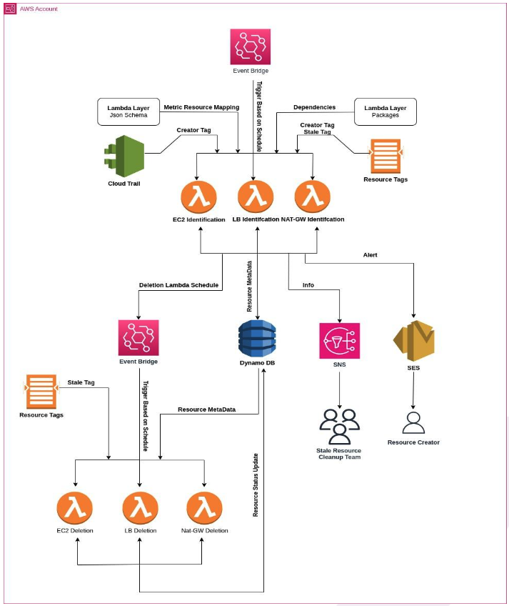

# 🧭 Automated AWS Cost Optimization System (EC2 / LB / NAT Gateway)

> A governance workflow for idle AWS resources, not another idle-resource detector.

---

## 🧩 Overview

Detecting idle resources is a solved problem. AWS Compute Optimizer has
shipped idle-resource detection natively since November 2024, and most
cost tools do some version of "flag anything with low CPU." That part is
commodity — this project isn't trying to out-detect it.

What detection alone doesn't do is close the loop: figure out **who**
owns a flagged resource, **tell them directly**, give them a **grace
period** to justify or reclaim it, and only then turn the finding into a
**reviewable change** instead of a silent deletion. That loop — not the
detection step — is what this system is built around, applied
consistently across **EC2 instances**, **Load Balancers**, and **NAT
Gateways**:

- Resolves ownership from resource tags, falling back to **CloudTrail**
  when no tag is present
- Notifies the owner directly via **SES**
- Records every finding in **DynamoDB** so nothing is only ever an email
- Publishes a summary to **SNS** for the ops/FinOps team
- Applies a grace period before any remediation is taken, using
  **CloudWatch metrics** to decide what's actually idle in the first
  place

---

## ⚙️ Key Features

- 🔍 **Multi-Region Scanning** for EC2, LB, and NAT GW  
- 📊 **CloudWatch Metrics Analysis** via `GetMetricData`  
- ⚡ **Idle Detection** using CPU %, Network I/O, and connection thresholds  
- 🧾 **Ownership Resolution** via `creator` tag or CloudTrail logs  
- 🗃️ **Data Persistence** in DynamoDB  
- 📧 **SES Alerts** for owners + **SNS Summaries** for ops teams  
- ⏰ **Optional Auto-Delete Scheduling** through EventBridge rules  
- 🧱 **Lambda Layers** for reusable schema + dependencies  

---

## 🏗️ Architecture Overview

Below is the system’s AWS architecture showing how the components interact end-to-end:



## 🧱 Core Components

| Component | Description |
|------------|--------------|
| **EC2 Auditor Lambda** | Scans EC2 instances; checks CPU and network activity. |
| **LB Auditor Lambda** | Monitors ALB/NLB/CLB/GLB; detects inactive load balancers. |
| **NAT GW Auditor Lambda** | Detects idle NAT Gateways using connection metrics. |
| **DynamoDB** | Stores detected stale resource metadata. |
| **SNS** | Sends summaries to Ops / FinOps team. |
| **SES** | Notifies resource owners directly. |
| **EventBridge** | Schedules auto-deletion events. |
| **Lambda Layers** | Provide shared schema + dependency packages. |

---

## 📊 Metric Definitions

Metrics tracked for each resource type, with statistics and units:

| Resource | Metrics | Stat | Unit |
|-----------|----------|------|------|
| **EC2** | NetworkIn, NetworkOut, CPUUtilization | Sum / Average | Bytes / Percent |
| **NAT GW** | ConnectionAttemptCount | Sum | Count |
| **LB** | RequestCount | Sum | Count |

---

## 🧠 Idle Detection Logic

| Resource | Metric | Idle Criteria | Thresholds |
|-----------|---------|----------------|-------------|
| **EC2** | CPUUtilization + NetworkIn/Out | CPU < 10% and Network < 5 MB/day | 10% / 5 MB |
| **LB** | RequestCount | < 1000 requests in 7 days | 1000 req/week |
| **NAT GW** | ConnectionAttemptCount | < 7 connection attempts in 7 days | 7 attempts |

---

## 🔄 Workflow Summary

### 1️⃣ **Discovery & Ownership**
- Enumerates EC2, LB, and NAT Gateways via AWS APIs.
- Resolves `creator` tag or infers from CloudTrail events.

### 2️⃣ **Metrics Collection**
- Fetches resource metrics from CloudWatch using schema definitions.

### 3️⃣ **Idle Evaluation**
- Applies thresholds to determine if a resource is idle.

### 4️⃣ **Storage & Notification**
- Writes details into DynamoDB.
- Sends SES email to the resource owner.
- Publishes a summary message via SNS.

### 5️⃣ **Auto-Deletion (Optional)**
- EventBridge schedules cleanup after `N` minutes.

---

## 🪜 Deployment Guide

1. **Create Lambda Layers**
   - `layers/packages` → `boto3`, etc.
   - `layers/schema` → Metric definitions.

2. **Deploy Auditor Lambdas**
   - EC2, LB, and NAT GW functions.
   - Configure IAM roles and policies.

3. **Create DynamoDB Table**
   ```bash
   aws dynamodb create-table --table-name stale-resources ...
   ```

4. **Setup Notifications**
   - Verify SES sender email.
   - Create and subscribe to SNS topic.

5. **Configure EventBridge**

6. **Set Environment Variables**
   - Configure region, table, thresholds, topic ARN.

---

## 🏁 Summary

The **AWS Idle Resource Auditor** provides a fully automated, serverless framework for identifying, notifying, and cleaning up unused AWS resources.  
It combines **CloudWatch**, **DynamoDB**, **SNS/SES**, and **EventBridge** to promote cost efficiency and better cloud hygiene.

