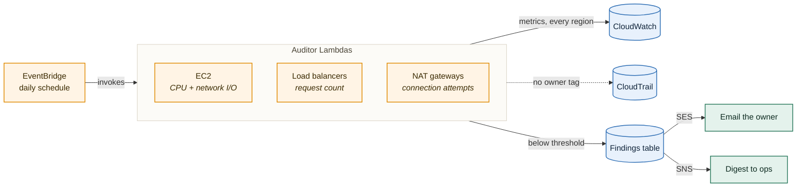
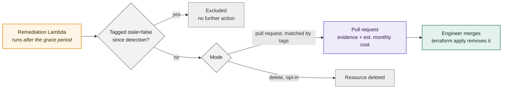
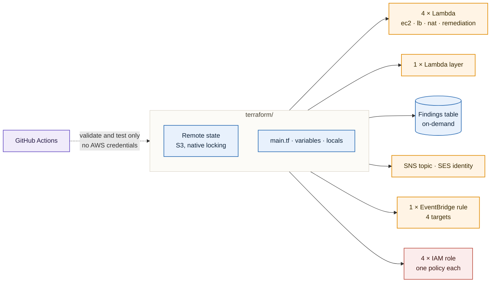

# Automated AWS Cost Optimization System

> A governance workflow for idle AWS resources, not another idle-resource detector.

AWS Compute Optimizer has flagged idle compute natively since November
2024, and most cost tools do some version of "alert on low CPU." That
part is commodity, and this project doesn't try to out-detect it.
Detection alone doesn't close the loop, though: it doesn't figure out
who owns a flagged resource, tell them directly, give them a chance to
justify or reclaim it, or turn a stale finding into a change someone
actually reviews. That loop is what this system builds, applied the
same way across EC2 instances, load balancers, and NAT gateways — a
tool that occasionally deletes something still in use loses the trust
it needs to be useful, so nothing here acts on a finding without a
grace period and, by default, a human in the loop.

---

## How it works

Three pieces run on the same daily schedule: detection, remediation,
and the Terraform config that provisions both.

Detection scans every region once a day. Each auditor Lambda reads a
different signal for its resource type, resolves an owner from a tag
or a CloudTrail lookup, and writes anything idle to a findings table —
the owner gets an email, ops gets a daily digest.



Nothing gets touched until a finding survives its grace period, about
a week by default. At that point remediation checks one thing before
acting — has the owner tagged the resource `stale=false` since it was
found — and only then opens a pull request against your infrastructure
repo, or deletes the resource directly if you've explicitly opted into
that mode.



Everything above is provisioned by Terraform, not created by hand:
four Lambdas, one shared layer, the findings table, the notification
topic and identity, and the schedule that drives all of it. CI
validates and tests the configuration on every run and never touches
AWS — there's nothing for it to deploy.



---

## Detection

| Resource | Metric | Stale when | Evaluation window |
|---|---|---|---|
| EC2 instance | CPUUtilization, NetworkIn, NetworkOut | CPU below 10%, or both NetworkIn and NetworkOut below 5 MB | `time_frame_days`, default 7 days |
| Load balancer | RequestCount | 1000 requests or fewer | Fixed at 7 days — hardcoded in `lb.py`, not wired to `time_frame_days` |
| NAT gateway | ConnectionAttemptCount | 7 attempts or fewer | Fixed at 7 days — same hardcoding as the load balancer scan |

An instance is flagged if either condition holds on its own: low CPU is
enough by itself, and so is low traffic on both directions, since a
box can be CPU-idle while still serving meaningful network traffic (or
the reverse). A resource younger than its evaluation window is skipped
outright rather than judged on partial data.

Ownership resolves from a `creator` tag first. When that's missing,
the auditor falls back to a CloudTrail lookup for the API call that
created the resource, within a window starting at its creation time.
An owner who wants a resource left alone tags it `stale=false` — the
next scan excludes it before any metric is even evaluated, and if a
finding for it already exists, remediation checks this same tag again
before acting on it.

---

## Remediation

A finding sits untouched for `deletion_delay_minutes` after detection —
about a week (10,050 minutes) by default. Once that grace period has
elapsed, the remediation Lambda re-fetches the resource's current tags
one more time before doing anything, and skips it — marking the
finding `Excluded` — if the owner has since tagged it `stale=false`.
It does not re-check CloudWatch. A resource that quietly became busy
again during the grace period, without anyone re-tagging it, still
gets remediated on the original week-old finding; closing that gap
would mean duplicating each auditor's metric and threshold logic
inside remediation for all three resource types, and that's a
deliberate scope cut here, not an oversight.

Two modes govern what happens next, set by `remediation_mode`:

- `pr` (the default) opens a pull request against a target Terraform
  repo, removing or resizing the flagged resource's block. The PR body
  carries the resource ID and type, region, owner, the tags it matched
  on, the CloudWatch evidence that flagged it, the threshold it
  crossed, a rough estimated monthly cost, and a reminder that tagging
  the resource `stale=false` makes the PR safe to close unmerged.
- `delete` calls AWS directly and removes the resource with no review
  step. It's a separate, explicit opt-in — Terraform only grants the
  remediation Lambda's IAM role the actual delete permissions
  (`ec2:TerminateInstances`, `ec2:DeleteNatGateway`,
  `elasticloadbalancing:DeleteLoadBalancer`) when this mode is
  selected, so a `pr`-mode deployment's role physically cannot delete
  anything, regardless of what any Lambda environment variable claims.

Opening a PR means finding the right block in the target repo's `.tf`
source, and that matching is tag-based today, not state-based. The
AWS resource ID Terraform assigns at apply time is normally recorded
only in state — it essentially never appears in source, so searching
for it there finds nothing in the common case. Tags usually are
written literally in a resource's `tags = { ... }` block, and they're
also what the auditors already capture into each finding, which makes
them the reliable join available without touching state. Remediation
requires every tag on a finding to match a resource block's own tags,
in exactly one file, or it refuses to act rather than guess — no
match, more than one match, and a resource with no tags block at all
are all treated the same way. The robust fix is reading the target
repo's actual Terraform state, which needs backend access this project
deliberately avoids requiring anywhere else, so it stays out of scope
for now rather than being quietly assumed away. If your infrastructure
repo isn't consistently tagged, or its tags have drifted from what's
actually running, this won't find the resource — that's a real gap,
worth knowing before relying on this for anything that matters.

---

## Deployment

Everything above is provisioned from `terraform/`. Nothing is created
by hand.

#### Prerequisites

- An AWS account, with credentials available to Terraform through
  whatever mechanism the AWS provider already supports — environment
  variables, an `~/.aws/credentials` profile, or SSO.
- Terraform >= 1.5.0 (built and tested against 1.14.x).
- `python3` and `pip3` on the machine running `terraform apply`. The
  remediation Lambda's build step shells out to `pip3 install` to
  package its one third-party dependency, `requests`, alongside its
  code — `archive_file` can't run pip on its own.
- An S3 bucket for Terraform state, created once and outside this
  config, with versioning and default encryption already turned on.
  This config can't create the very bucket it needs as its own
  backend. State locking uses S3's own native locking
  (`use_lockfile = true`); there's no separate DynamoDB lock table to
  provision.
- For PR-mode remediation, the default: a GitHub personal access token
  with write access to contents and pull requests on the Terraform
  repo you want PRs opened against, and that repo's `owner/repo` name.

#### Steps

1. Copy `terraform/backend.hcl.example` to `terraform/backend.hcl` and
   fill in your state bucket's name, a state key, and its region.
2. Copy `terraform/terraform.tfvars.example` to
   `terraform/terraform.tfvars` and fill in your own values — see the
   configuration reference below. Don't put a real `github_token` in
   this file; export it instead:
   ```bash
   export TF_VAR_github_token="ghp_..."
   ```
3. From `terraform/`:
   ```bash
   terraform init -backend-config=backend.hcl
   terraform plan
   terraform apply
   ```

#### Verifying the SES sender address

`aws_ses_email_identity.sender` registers `ses_sender` with SES, but
AWS emails that address a verification link — nothing sends until
someone clicks it, and an unverified identity fails silently rather
than raising anywhere visible. Check that inbox right after `apply`.
Each auditor already logs and swallows a send failure instead of
crashing the scan, so if owner emails aren't arriving, check both
CloudWatch Logs and the identity's status in the SES console.

#### After the first scheduled run

Check each Lambda's CloudWatch Logs group for errors, check the
DynamoDB table for new items with `Deletion_Status = "Marked"`, and
check that the SNS summary reached `ops_notification_email`.
Remediation runs on this same schedule but does nothing on the first
few days — every fresh finding's grace period hasn't elapsed yet.

#### Teardown

```bash
terraform destroy
```

This removes everything Terraform created. It doesn't touch the state
bucket, since that was created outside this config — delete it
separately if you're done with it for good.

---

## Configuration reference

| Variable | Purpose | Default | Required |
|---|---|---|---|
| `project_name` | Prefixes and tags every resource. | — | Yes |
| `aws_region` | Region everything deploys into. | `ap-southeast-1` | No |
| `lambda_timeout` | Timeout, in seconds, for the auditor Lambdas. | `300` | No |
| `lambda_memory_size` | Memory, in MB, for the auditor Lambdas. | `256` | No |
| `table_name` | DynamoDB table findings are recorded in. | — | Yes |
| `ses_sender` | Verified SES address owner emails are sent from. | — | Yes |
| `ops_notification_email` | Address subscribed to the SNS summary topic. | — | Yes |
| `cpu_threshold_percent` | EC2 CPU percent below which an instance is idle. | `10` | No |
| `network_threshold_bytes` | EC2 NetworkIn/Out bytes below which an instance is idle. | `5 MB` | No |
| `lb_request_count_threshold` | Load balancer request count below which it's idle. | `1000` | No |
| `nat_gw_connection_threshold` | NAT gateway connection attempts below which it's idle. | `7` | No |
| `deletion_delay_minutes` | Grace period before a finding is eligible for remediation. | `10050` (~7 days) | No |
| `scan_schedule_expression` | EventBridge schedule the scans and remediation run on. | `rate(1 day)` | No |
| `time_frame_days` | Lookback window for the EC2 scan only — see Detection above. | `7` | No |
| `remediation_mode` | `pr` opens a pull request; `delete` acts on AWS directly. | `"pr"` | No |
| `github_token` | GitHub token with write access on `target_repo`. Only used, and only required, in `pr` mode. Set via `TF_VAR_github_token`, never in a file. | — | Only in `pr` mode |
| `target_repo` | `owner/repo` of the Terraform repo PRs are opened against. | — | Only in `pr` mode |
| `branch_prefix` | Prefix for each remediation branch. | `auto-remediation` | No |
| `base_branch` | Branch remediation branches from and opens PRs against. | `main` | No |

Every one of these becomes a Lambda environment variable read once at
import time by `layers/schema/config.py` (the three auditors) or
`functions/remediation/config.py` (remediation), each of which raises
immediately on a missing required value or an invalid number rather
than failing partway through a scan.

---

## Running the tests

```bash
python3 -m venv .venv
source .venv/bin/activate
pip install -r tests/requirements.txt
pytest
```

The suite needs no AWS account and no credentials. `moto` mocks every
AWS service in-process, and `conftest.py` sets obviously-fake
credentials on top of that specifically so any call that somehow
escapes the mock fails on bad auth instead of reaching a real account.
EC2 and NAT gateway each have three cases: an idle resource that's
flagged, a busy one that isn't, and one explicitly excluded via
`stale=false` — that last case matters most, because a tool that flags
something still in active use is the failure that erodes trust
fastest. The load balancer detector currently has two of those three:
idle-and-flagged and `stale=false`-excluded. Its busy-and-not-flagged
case was dropped — it depended on moto's CloudWatch mock in a way that
was flaky in CI (timing-sensitive, not a bug in `lb.py` itself) and
removing it was the pragmatic call rather than chasing an
intermittent, hard-to-reproduce mock issue further. The underlying
behavior (a busy load balancer isn't flagged) is still exercised by
`ec2.py`'s and `nat_gw.py`'s equivalent tests using the same threshold
logic pattern; this is a gap in that one file's specific coverage, not
in the detection logic itself.

---

## What it costs to run

At the default one-scan-a-day schedule, this is a handful of Lambda
invocations, a few DynamoDB writes, and a couple of SNS/SES messages
per day — comfortably inside AWS's free tier for a personal or small
team deployment, and a few cents a month at most outside it. The tool
is not what costs money here. A single idle NAT gateway, one of the
exact things this system is built to catch, runs about $32/month on
its own — $0.045 an hour, per `functions/remediation/pricing.py`,
whether or not any traffic ever passes through it — before any
data-processing charges. The point of this project is finding that
$32, not the cents it costs to look.

---

## Limitations and what's next

- Remediation matches resources by tags, not Terraform state, because
  the state lookup that would remove that ambiguity needs backend
  access this project deliberately doesn't require anywhere else. See
  the Remediation section above for what that means in practice.
- The safety re-check before acting only re-verifies tags, not
  CloudWatch metrics — a resource that became busy again mid-grace-period
  without a `stale=false` tag still gets remediated on stale data.
- Coverage is EC2 instances, load balancers, and NAT gateways only.
  EBS volumes, RDS instances, Elastic IPs, and S3 are not scanned.
- There's no cross-account or multi-region-in-parallel support —
  `describe_regions` covers every region from wherever it's deployed,
  but it deploys into, and reads findings from, a single AWS account.
- This hasn't been run against a live AWS account yet. The Terraform
  plan validates and the test suite passes against mocked AWS, but no
  real scan, email, or pull request has been produced by this exact
  configuration — see the journal for what that first run needs to
  cover before it's evidenced here.
- The load balancer detector's "busy resource isn't flagged" case
  isn't covered by an automated test — see Running the tests above for
  why it was dropped rather than fixed.
